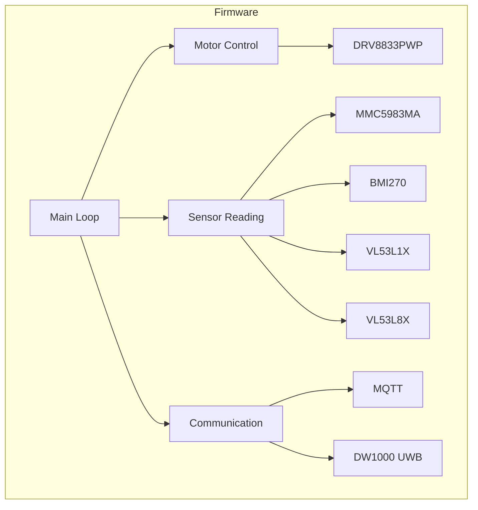

# Dropbot firmware

> Dropbot is an open source, low cost, robot designed to form a swarm of robots that can be used for practical research in swarm robotics.

## Overview

The robot is composed of the following components:
- **Microcontroller**: ESP32-C6
- **Motors Driver**: DRV8833PWP driving two N20 micro gear motors
- **Power**: 2S1P LiPo battery (7.4V) with a BQ25887 battery management IC powered via USB-C
- **UWB**: DW1000 for ranging and communication
- **IMU**: MMC5983MA and BMI270 for orientation and acceleration sensing
- **Proximity Sensors**: VL53L1X or VL53L8X ToF sensors for obstacle detection

### Communication

The ESP32-C6 microcontroller provides Wi-Fi connectivity for remote control and data transmission. The DW1000 UWB module can be used for precise positioning and-optionally-for communication between robots in the swarm.

MQTT is used as the communication protocol for sending commands and receiving data from the robot.

### Software

The ffirmware is developed using embedded Rust, using `esp-hal` for hardware abstraction and `embedded-hal` traits for motor control, sensor interfacing, and communication. The firmware is designed to be modular and extensible, allowing for easy addition of new features and sensors in the future.

Embassy is used for task scheduling and concurrency, enabling efficient management of the various components and sensors on the robot.

As follows is a high-level overview of the firmware architecture:

The firmware is designed to be efficient (in terms of both performance and power consumption) while providing the necessary functionality for controlling the robot and enabling swarm behavior. Real-time constraints are considered, especially for motor control and sensor reading, to ensure responsive behavior in dynamic environments, i.e., when navigating around obstacles or coordinating with other robots in the swarm.